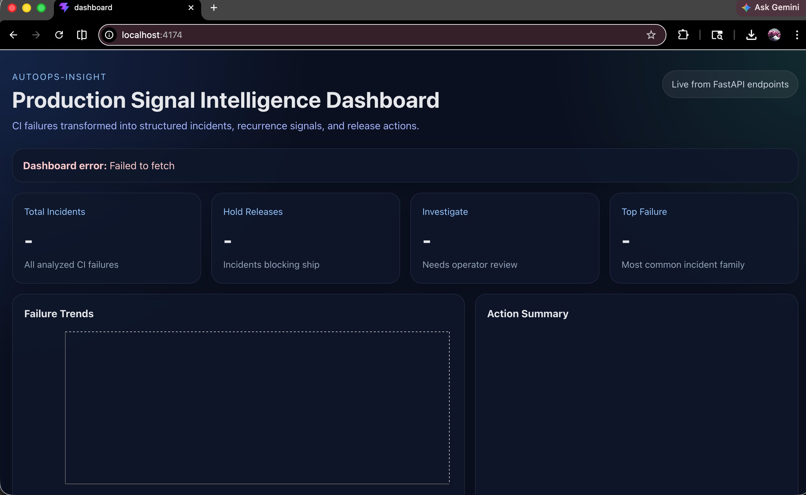
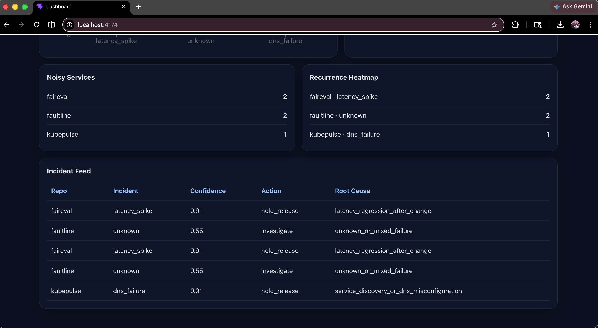

# AutoOps-Insight — CI Failure Intelligence and Release Risk Reporting

**AutoOps-Insight turns noisy CI failures into structured incident intelligence and release decisions.**

`FastAPI` · `Kafka` · `PostgreSQL` · `React/Vite` · `scikit-learn`

---

## Why This Project Matters in Hiring Terms

- Shows end-to-end backend platform engineering: log ingestion → classification → structured decision → live dashboard
- Shows release engineering judgment: not just "what failed" but "should we ship"
- Shows developer tooling design: rule-driven + ML-backed, with audit trails and rollback preview
- Relevant to: SRE, production engineering, internal developer tooling, platform infrastructure

---

## Proof, Up Front

| Signal | Result |
|---|---|
| Incident families classified | 3 named (`timeout`, `dns_failure`, `latency_spike`) + `unknown` catch-all |
| Total analyses in live run | 5 |
| Hold-release decisions generated | 3 |
| Investigate decisions generated | 2 |
| Confidence on `dns_failure` classification | **0.91** |
| Confidence on `latency_spike` classification | **0.91** |
| Recurring signature detected | `dns_failure:818a0911c2c842c0` caught twice, separate runs |
| Release-risk output | Structured JSON + markdown, machine-readable and human-readable |



*Production Signal Intelligence Dashboard — live from FastAPI endpoints. 5 total incidents · 3 hold releases · 2 investigate · top failure: `latency_spike`*

---

## Incident Feed



*Noisy services ranked · Recurrence heatmap (service × failure family) · Full incident feed with confidence scores and root cause labels*

---

## Quick Demo

```bash
git clone https://github.com/kritibehl/AutoOps-Insight
cd AutoOps-Insight
python3 -m venv .venv && source .venv/bin/activate
pip install -r requirements.txt
cd ml_model && python train_model.py && cd ..
uvicorn main:app --reload &
python3 cli.py analyze sample.log   # classify a CI log
python3 cli.py report               # generate release risk report
```

---

## The Problem

When a CI pipeline fails, an on-call engineer opens a wall of logs and starts guessing. The raw log tells you what happened last. It does not tell you whether this failure has appeared before, whether something changed near the incident window, whether rollback is worth trying, or who owns the problem.

Most teams handle this with Slack noise, manual grep, and tribal knowledge. AutoOps encodes the answers.

---

## What AutoOps Does

- **Classifies** raw CI log text into named failure families via rule-based matching + ML fallback
- **Fingerprints** each incident with a stable signature (`family:hash`) for cross-run comparison
- **Detects recurrence** — identifies when two separate failures share the same root cause signature
- **Correlates** incidents with nearby audit events in a configurable time window
- **Generates runbooks** — per-family, structured: first checks, likely cause, escalation route, mitigation steps
- **Blocks releases** — outputs `hold_release` / `investigate` per incident, plus a fleet-level risk summary
- **Simulates rule changes** — dry-run before applying, with per-incident impact preview

---

## Architecture

```
Raw CI log
    │
    ▼
Rule engine (config/rules.yaml)     ← add patterns without touching backend code
    │
    ▼
ML fallback (TF-IDF + Logistic Regression)
    │
    ▼
Incident record (PostgreSQL)
    ├── failure_family · confidence · signature
    ├── probable_owner · release_blocking
    └── recurrence count
    │
    ▼
Timeline correlation engine         ← configurable window, burst detection
    │
    ▼
Release risk report
    ├── hold_release / investigate (per incident)
    ├── recurring signatures (fleet-level)
    └── rollback_review_suggested
    │
    ▼
React/Vite dashboard  ←→  FastAPI  ←→  Kafka (event stream)
```

---

## Evidence Table

| Incident | Family | Confidence | Action | Root Cause |
|---|---|---|---|---|
| faireval latency | `latency_spike` | 0.91 | `hold_release` | `latency_regression_after_change` |
| faultline CI | `unknown` | 0.55 | `investigate` | `unknown_or_mixed_failure` |
| faireval latency (repeat) | `latency_spike` | 0.91 | `hold_release` | `latency_regression_after_change` |
| faultline CI (repeat) | `unknown` | 0.55 | `investigate` | `unknown_or_mixed_failure` |
| kubepulse DNS | `dns_failure` | 0.91 | `hold_release` | `service_discovery_or_dns_misconfiguration` |

Recurring signature `dns_failure:818a0911c2c842c0` surfaced twice across separate CI runs, automatically, without manual comparison.

---

## Example Output

**Incident analysis:**
```json
{
  "predicted_issue": "timeout",
  "confidence": 0.95,
  "failure_family": "timeout",
  "severity": "high",
  "signature": "timeout:733da8a4e20740af",
  "likely_cause": "operation exceeded threshold or dependency responded too slowly",
  "first_remediation_step": "inspect the exact timed-out operation and compare recent latency trends",
  "probable_owner": "platform-networking",
  "release_blocking": true,
  "recurrence": { "total_count": 3, "is_recurring": true }
}
```

**Release risk summary:**
```
Release Risk Summary
  Release risk:               HIGH
  Total analyses:             3
  Release-blocking incidents: 3

  Top recurring signature:
    timeout:733da8a4e20740af | family=timeout | severity=high | count=3

  Recommendation:
    Repeated failure signatures present. Investigate before promoting build.
```

**Timeline correlation:**
```json
{
  "correlation_summary": {
    "burst_detected": true,
    "nearby_change_detected": true,
    "rollback_review_suggested": true,
    "release_blocking_count": 3
  }
}
```

---

## Full Setup

```bash
git clone https://github.com/kritibehl/AutoOps-Insight
cd AutoOps-Insight
python3 -m venv .venv && source .venv/bin/activate
pip install -r requirements.txt
cd ml_model && python train_model.py && cd ..
uvicorn main:app --reload

python3 cli.py fleet-health
python3 cli.py simulate-rule timeout_rule probable_owner platform-networking

cd autoops-ui && npm install && npm run dev

# With PostgreSQL
docker run -e POSTGRES_PASSWORD=pass -p 5432:5432 postgres:15
alembic upgrade head
```

---

## API

| Method | Endpoint | Description |
|---|---|---|
| `POST` | `/analyze` | Classify a CI log, persist incident |
| `GET` | `/incidents` | List all persisted incidents |
| `GET` | `/history/recurring` | Top recurring signatures |
| `GET` | `/reports/summary` | Fleet release-risk summary |
| `GET` | `/incident/runbook/{family}` | Structured operator runbook |
| `GET` | `/incident/correlate` | Correlate incident against nearby changes |
| `GET` | `/fleet/health` | Noisy-service ranking + recurrence view |
| `POST` | `/reporting/export-powerbi` | BI-ready CSV export |
| `GET` | `/metrics` | Prometheus counters |
| `GET` | `/healthz` | Health check |

---

## Failure Taxonomy

| Family | Severity | Release blocking |
|---|---|---|
| `timeout` | high | yes |
| `dns_failure` | high | yes |
| `latency_spike` | high | yes |
| `oom` | critical | yes |
| `connection_refused` | high | yes |
| `crash_loop` | critical | yes |
| `retry_exhausted` | medium | yes |
| `flaky_test_signature` | medium | context-dependent |

---

## Why This Matters

The knowledge gap on-call engineers carry — "is this new or recurring, who owns it, is rollback worth it" — doesn't transfer and doesn't scale. AutoOps structures it: stable fingerprints replace pattern memory, correlation windows replace manual dashboard-hopping, runbook generation replaces tribal knowledge.

The two-layer classification design means deterministic rules handle the high-confidence cases (fast, auditable, no model dependency), and ML picks up the long tail. Both paths write to the same incident schema, so the release decision layer is independent of which path classified the incident.

---

## Limitations

- Log-based analysis only — not real-time metric stream ingestion
- ML model trained on labeled sample data; novel log formats require retraining
- Correlation is time-window based, not causal trace analysis
- Kafka is wired into the architecture and validated locally, not as a distributed production cluster
- PostgreSQL recommended for any real-volume use; SQLite available for local development

---

## Interview Notes

**Design decision:** Two-layer classification — deterministic rules first, ML fallback second. Keeps high-confidence cases fast and auditable; reserves ML for the long tail. Tradeoff: ML accuracy depends on training coverage, so the rule layer carries reliability in practice.

**Hard problem:** Stable fingerprinting. Using `family:hash(normalized_log_signature)` rather than raw text means minor log format differences don't break recurrence detection — but the normalization logic becomes load-bearing. Getting it wrong produces false recurrence signals.

**Metric I'd highlight:** 0.91 confidence on `dns_failure` with a rule-based classifier, no GPU, no transformer model. Fast, explainable, debuggable — which matters more for on-call tooling than raw accuracy.

**What I'd build next:** Event-triggered correlation. Fixed 60-minute windows produce false positives when incidents cluster non-uniformly. An event-driven model would tighten that to causally adjacent incidents.

---

## Relevant To

`SRE` · `Production Engineering` · `Release Engineering` · `Internal Developer Tooling` · `Platform / Infrastructure`

---

## Stack

Python · FastAPI · React/Vite · PostgreSQL · SQLite · Alembic · scikit-learn · Docker · GitHub Actions

---

## Related

- [Faultline](https://github.com/kritibehl/faultline) — exactly-once execution under distributed failure
- [KubePulse](https://github.com/kritibehl/KubePulse) — Kubernetes resilience validation and deployment safety
- [DetTrace](https://github.com/kritibehl/dettrace) — deterministic replay for concurrency failures
- [Postmortem Atlas](https://github.com/kritibehl/postmortem-atlas) — historical production outage analysis