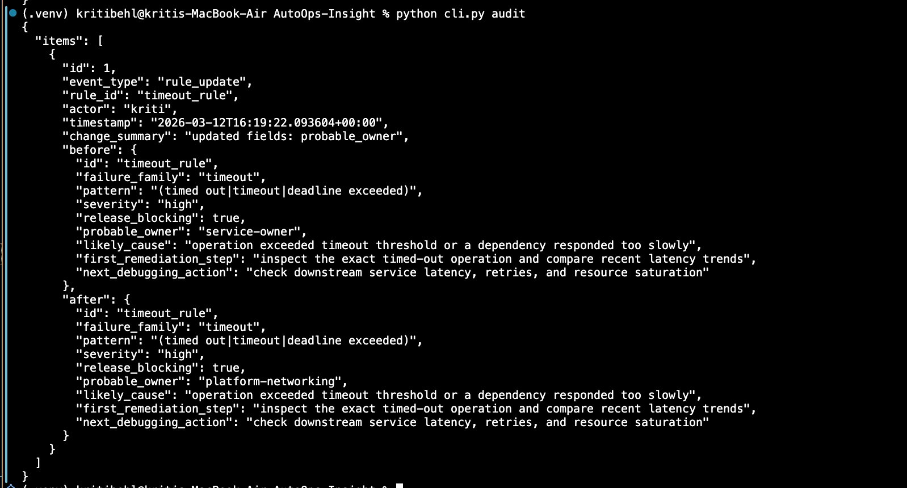
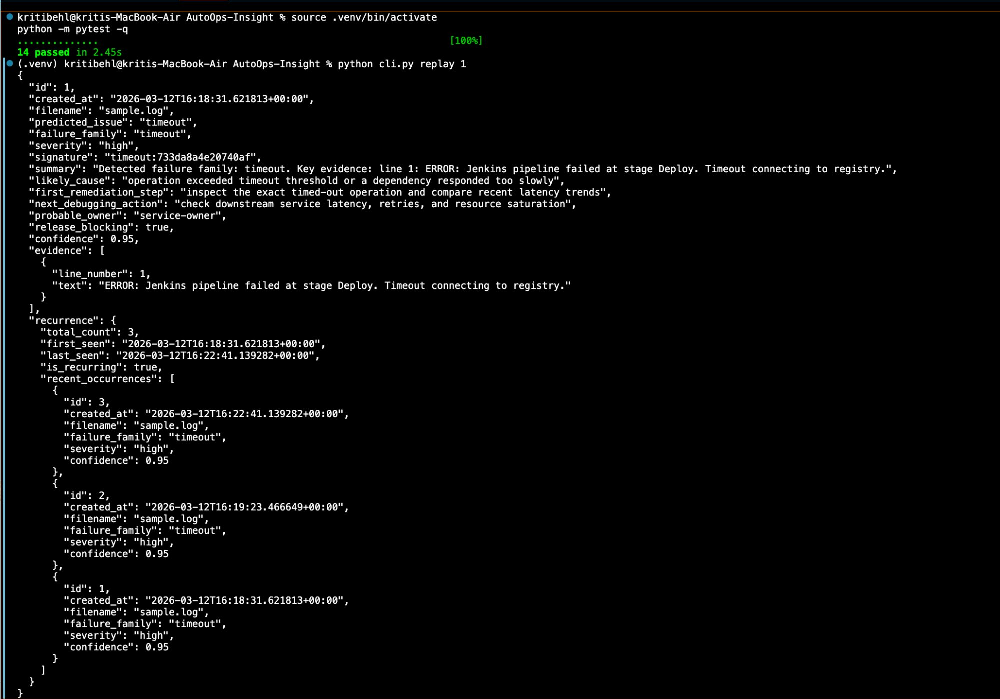

# AutoOps-Insight

> A reliability analytics tool for CI and infrastructure failures — classifies logs, fingerprints recurring incident signatures, tracks historical recurrence, detects anomaly patterns, and generates release-risk summaries.

---

## What It Does

AutoOps-Insight transforms raw failure logs into structured, actionable reliability intelligence. Rather than labeling a log as simply "timeout", it produces a structured incident artifact with severity, likely cause, remediation steps, ownership, and a stable fingerprint for tracking recurrence over time.

**It answers questions like:**
- Has this failure happened before, and how often?
- Is this build environment risky enough to block a release?
- What failure patterns are dominating recent CI runs?
- Which recurring signatures should the team prioritize?

---

## Architecture

```
Log Sources
   │
   ▼
Incident Parser
   │
   ▼
Rules Engine (YAML) + ML-Assisted Classification
   │
   ▼
Structured Incident Analysis
(severity · signature · likely cause · owner · release-blocking flag)
   │
   ▼
SQLite Incident Store
   │
   ├── Recurrence / Replay
   ├── Release-Risk Reports
   ├── Audit Log
   └── Dashboard / API / CLI
```

---

## Features

### Structured Incident Analysis

Each log upload produces a structured incident record:

| Field | Description |
|---|---|
| `predicted_issue` | Failure type (e.g. `timeout`, `oom`, `flaky_test_signature`) |
| `confidence` | ML classification confidence |
| `failure_family` | Normalized operational category |
| `severity` | `low` / `medium` / `high` / `critical` |
| `signature` | Stable fingerprint for recurrence tracking |
| `summary` | Human-readable incident summary |
| `likely_cause` | Taxonomy-based likely cause hint |
| `first_remediation_step` | What to check first |
| `next_debugging_action` | Suggested follow-up |
| `probable_owner` | Probable service/team ownership hint |
| `release_blocking` | Whether this should gate a release |
| `evidence` | Supporting log lines |
| `recurrence` | How many times this signature has appeared |

### Signature Fingerprinting

Each incident gets a stable, normalized signature like `timeout:733da8a4e20740af`. This enables cross-run recurrence tracking — the system knows when two failures are the same underlying issue despite volatile log content.

### Historical Recurrence Tracking

Results persist in SQLite. The system tracks total occurrence count per signature, first and last seen timestamps, recurring signature qualification, and recent failure-family distribution statistics.

### Release-Risk Reporting

The report engine aggregates stored history into a release-risk summary (`low` / `medium` / `high` / `critical`) based on:

- Presence of release-blocking incidents
- Recurring signature concentration
- Anomaly flags (e.g. one signature accounting for 80% of recent failures)
- Window comparison vs. baseline blocker rate

### Anomaly Detection

Heuristic-based flags that surface meaningful signals without overfitting:

- Signature concentration spikes
- High-count recurring failures
- Family-level spikes
- Release blocker saturation

### Dashboard

A React/Vite frontend (`autoops-ui/`) showing release risk score, blocker count, recurring signatures, anomaly panel, recent analyses, failure-family distribution, and a markdown report preview. Log upload triggers a full incident breakdown inline.

The classifier uses two layers:

**Rule-based detection** checks for deterministic patterns:
`timeout` · `dns_failure` · `connection_refused` · `tls_failure` · `retry_exhausted` · `oom` · `flaky_test_signature` · `dependency_unavailable` · `crash_loop` · `latency_spike`

**ML fallback** uses TF-IDF vectorization and Logistic Regression trained on labeled log data (`ml_model/log_train.csv`). Each analysis record indicates which detection path was used.

### Failure Taxonomy

| Family | Severity | Release Blocking |
|---|---|---|
| `timeout` | high | yes |
| `oom` | critical | yes |
| `connection_refused` | high | yes |
| `dns_failure` | high | yes |
| `flaky_test_signature` | medium | context-dependent |
| `retry_exhausted` | medium | yes |
| `crash_loop` | critical | yes |
| `dependency_error` | high | yes |
| `dependency_unavailable` | high | yes |

---

## API

FastAPI backend exposing:

| Method | Endpoint | Description |
|---|---|---|
| `POST` | `/predict` | Lightweight issue classification |
| `POST` | `/analyze` | Analyze a log and persist the result |
| `POST` | `/summarize` | Keyword-based summary extraction |
| `GET` | `/rules` | View active config-driven detection rules |
| `GET` | `/audit/recent` | Recent audit log entries |
| `GET` | `/history/recent` | Recent incident list |
| `GET` | `/history/recurring` | Top recurring signatures |
| `GET` | `/history/signature/{signature}` | Recurrence detail for a signature |
| `GET` | `/history/analysis/{analysis_id}` | Stored incident detail |
| `GET` | `/reports/summary` | Structured release-risk summary (JSON) |
| `GET` | `/reports/markdown` | Human-readable markdown report |
| `POST` | `/reports/generate` | Write report artifacts to disk |
| `GET` | `/metrics` | Prometheus counters |
| `GET` | `/healthz` | Health check |

---

## CLI

```bash
python cli.py health
python cli.py analyze sample.log
python cli.py analyze sample.log --no-print-json
python cli.py replay 1
python cli.py audit
python cli.py report
```

---

## Getting Started

**1. Install dependencies**
```bash
python -m pip install -r requirements.txt
```

**2. Train or retrain the model**
```bash
cd ml_model
python train_model.py
cd ..
```

**3. Start the API server**
```bash
uvicorn main:app --reload
```

**4. Run the CLI**
```bash
python cli.py analyze sample.log
python cli.py replay 1
python cli.py report
```

**5. Start the dashboard**
```bash
cd autoops-ui
npm install
npm run dev
```

---

## CI Integration

A GitHub Actions workflow automatically:

- Runs a CLI health check
- Analyzes sample logs
- Generates markdown and JSON report artifacts
- Uploads report artifacts and the SQLite DB for inspection

---

## Example Workflow

```bash
# Analyze a failing log
python cli.py analyze sample.log

# Replay a stored incident by ID
python cli.py replay 1

# Update a detection rule
python cli.py update-rule-cmd timeout_rule probable_owner platform-networking --actor kriti

# Inspect the audit trail
python cli.py audit

# Generate a release-risk report
python cli.py report
```

---

## Project Structure

```
AutoOps-Insight/
├── main.py                     # FastAPI application and API routes
├── cli.py                      # Headless CLI for analysis and reporting
├── ml_predictor.py             # Structured incident analysis + ML-backed prediction
├── config/
│   └── rules.yaml              # Config-driven detection rules
├── classifiers/
│   ├── config_loader.py        # YAML rule loader
│   ├── rule_admin.py           # Rule update helper + audit integration
│   ├── rules.py                # Deterministic failure-family detection
│   └── taxonomy.py             # Severity, ownership, remediation metadata
├── analysis/
│   ├── formatter.py            # Incident summary formatting
│   ├── signatures.py           # Signature normalization and fingerprinting
│   ├── trends.py               # Trend/distribution/window analysis
│   └── anomalies.py            # Heuristic anomaly detection
├── storage/
│   ├── history.py              # SQLite persistence and historical queries
│   └── audit.py                # Audit log persistence
├── reports/
│   ├── renderer.py             # Markdown/JSON report generation
│   └── generated/              # Generated report artifacts
├── schemas/
│   └── incident.py             # Pydantic incident schema
├── ml_model/
│   ├── log_train.csv           # Training data
│   ├── train_model.py          # Training script
│   └── log_model.pkl           # Trained model + vectorizer
├── autoops-ui/                 # React/Vite dashboard
├── docs/
│   └── runbook.md              # Sample operator workflow
├── tests/                      # Unit and API integration tests
└── .github/workflows/          # CI workflow
```

---

## Tests

```bash
python -m pytest -q
```

Current suite: 14 passing tests, covering:

- Deterministic rule detection
- Signature stability and normalization
- Trend and anomaly heuristics
- Markdown report rendering
- API integration for `/analyze`, `/history/recent`, `/history/recurring`, and `/reports/summary`

---

## Observability

Prometheus counters exposed at `/metrics`:

- `logs_processed_total`
- `predict_requests_total`
- `analyze_requests_total`
- `summarize_requests_total`
- `report_requests_total`

---

## Config-Driven Rules

Detection rules live in `config/rules.yaml`. Failure-family patterns, severity, ownership hints, and remediation guidance can be updated without changing backend logic. Rule changes are recorded in an audit log with event type, rule ID, actor, timestamp, and before/after values.

---

## Execution Modes

| Mode | Description |
|---|---|
| **API** | Upload logs and query history/report endpoints via FastAPI |
| **CLI** | Analyze logs and generate reports headlessly for CI or local use |
| **Dashboard** | Inspect release risk, recurring signatures, anomalies, and reports in the React UI |
| **CI** | Run sample analyses and upload report artifacts via GitHub Actions |

---

## Runbook

A sample operator workflow is included in [`docs/runbook.md`](docs/runbook.md), covering:

- Latest log analysis
- Recurrence inspection
- Incident replay
- Rule review
- Audit trail inspection
- Release-risk triage

---

## Screenshots

### Audit Log Traceability

`python cli.py audit` — a `rule_update` event for `timeout_rule`, triggered by actor `kriti`, showing the full before/after diff: `probable_owner` changed from `service-owner` to `platform-networking`, with timestamp and complete rule state recorded.



### Incident Replay and Test Validation

`python cli.py replay 1` — replays a stored timeout incident (`signature: timeout:733da8a4e20740af`, severity `high`, confidence `0.95`, `release_blocking: true`) with full recurrence metadata showing 3 occurrences across a 4-minute window (`is_recurring: true`). Above it: 14 passing tests at 100% in 2.45s.



---

## Engineering Decisions

- **YAML rules instead of hardcoded-only logic** so detection patterns, severity, ownership hints, and remediation guidance can be updated without backend code changes.
- **Stable signature fingerprinting** to identify recurring incidents across noisy repeated logs and make recurrence tracking deterministic.
- **SQLite persistence** to keep replay, recurrence tracking, and reporting simple, inspectable, and easy to run locally.
- **Heuristic anomaly detection instead of overfit ML** to preserve explainability for operational triage and release-risk review.
- **API + CLI + dashboard + CI support** so the same system can support debugging, automation, visual inspection, and artifact generation.

---

## What This Is Not (Yet)

- Multi-source ingestion from system logs, containers, or metrics agents
- Time-series anomaly detection with robust statistical baselines
- Deep root-cause inference
- Multi-tenant incident correlation
- Production-scale storage or querying
- Real release gating inside a deployment pipeline
- Learned summarization or recommendation models

---

## Roles This Maps To

SRE · Production Engineering · Release Engineering · Internal Tooling · Platform / Infrastructure