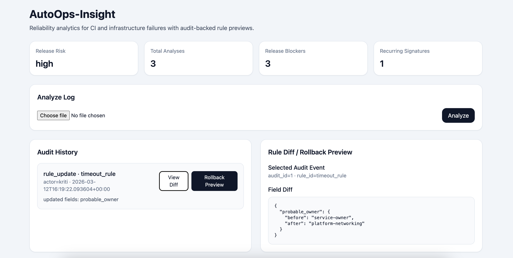

# AutoOps-Insight

> **Operator-facing incident triage tool that converts noisy CI/infra logs into structured incident evidence, recurrence signals, and operator-ready guidance.**

AutoOps-Insight is a production-support utility for on-call engineers, release owners, and platform/reliability teams. It ingests raw CI and infrastructure failure logs, classifies repeated incident patterns, correlates nearby changes, surfaces recurrence and blast-radius signals, and generates operator-ready guidance for faster triage and better release judgment.

**It answers questions operators face under pressure:**
- What kind of incident is this?
- Is this part of a repeated failure pattern?
- Did something change near the incident window?
- Is rollback worth considering?
- Who should own escalation?
- What should be checked first?

---

## Operator Workflow

```text
ingest logs → classify incident → simulate rule change → preview impact → rollback if needed
```

---

## Architecture

```text
Log Sources
   │
   ▼
Incident Parser
   │
   ▼
Rules Engine (YAML) + ML-Assisted Classification
   │
   ▼
Structured Incident Analysis
(severity · signature · likely cause · owner · release-blocking flag)
   │
   ▼
SQLite Incident Store
   │
   ├── Recurrence / Replay
   ├── Release-Risk Reports
   ├── Audit Log
   ├── Rule Simulation / Impact Preview
   ├── Fleet Health & BI Export
   └── Dashboard / API / CLI
```

---

## Who This Helps

**On-call engineers** — Move from raw logs to structured incident evidence, likely cause, escalation path, and mitigation steps faster.

**Release owners** — Surface release-blocking regressions, nearby change correlation, and rollback/no-rollback guidance for safer release judgment.

**Platform / reliability teams** — Highlight recurring failure signatures, noisy services, blast-radius patterns, and repeated regressions across services and subsystems.

---

## Features

### Structured Incident Analysis

Each log upload produces a structured incident record:

| Field | Description |
|---|---|
| `predicted_issue` | Failure type (e.g. `timeout`, `oom`, `flaky_test_signature`) |
| `confidence` | ML classification confidence |
| `failure_family` | Normalized operational category |
| `severity` | `low` / `medium` / `high` / `critical` |
| `signature` | Stable fingerprint for recurrence tracking |
| `summary` | Human-readable incident summary |
| `likely_cause` | Taxonomy-based likely cause hint |
| `first_remediation_step` | What to check first |
| `next_debugging_action` | Suggested follow-up |
| `probable_owner` | Probable service/team ownership hint |
| `release_blocking` | Whether this should gate a release |
| `evidence` | Supporting log lines |
| `recurrence` | How many times this signature has appeared |

### Signature Fingerprinting

Each incident gets a stable, normalized signature like `timeout:733da8a4e20740af`. This enables cross-run recurrence tracking — the system knows when two failures are the same underlying issue despite volatile log content.

### Historical Recurrence Tracking

Results persist in SQLite. The system tracks total occurrence count per signature, first and last seen timestamps, recurring signature qualification, and recent failure-family distribution statistics.

### Timeline Correlation Engine

Correlates incident windows with nearby operational context: deploy or rollout timing, change/config activity, bursts of repeated failures, release-blocking concentration, owner spread, and repeated failure-family clustering.

### Operator Runbook Generation

For each incident family, the tool suggests: first checks, likely cause, rollback/no-rollback guidance, escalation route, and mitigation sequence.

### Fleet Health and Recurrence Visibility

Fleet-level views surface: top recurring incident sources, noisy-service ranking, highest blast-radius regressions, incident recurrence by subsystem, and MTTR-style recurrence windows.

### Release-Risk Reporting

The report engine aggregates stored history into a release-risk summary (`low` / `medium` / `high` / `critical`) based on: presence of release-blocking incidents, recurring signature concentration, anomaly flags (e.g. one signature accounting for 80% of recent failures), and window comparison vs. baseline blocker rate.

### Anomaly Detection

Heuristic-based flags that surface meaningful signals without overfitting: signature concentration spikes, high-count recurring failures, family-level spikes, and release blocker saturation.

### Network / Infra-Aware Incident Taxonomy

The system supports incident families grounded in production symptoms rather than generic log labeling:

| Family | Severity | Release Blocking |
|---|---|---|
| `timeout` | high | yes |
| `oom` | critical | yes |
| `connection_refused` | high | yes |
| `dns_failure` | high | yes |
| `tls_handshake` | high | yes |
| `flaky_test_signature` | medium | context-dependent |
| `retry_exhausted` | medium | yes |
| `crash_loop` | critical | yes |
| `dependency_unavailable` | high | yes |
| `intermittent_network_flap` | medium | context-dependent |

### Rule Simulation and Impact Preview

Admins can dry-run rule changes against stored incidents before applying them. Simulation preview answers: how many incidents would be evaluated, how many would be impacted, whether `failure_family`, `severity`, `release_blocking`, or `probable_owner` would change, and which stored incidents would be affected.

### Rule Diff and Rollback Preview

AutoOps-Insight shows a field-level diff between the current and simulated rule, a rollback preview for an audit event, and the expected impact of reverting a previous rule update before making the change. These workflows make rule changes safer for operator-managed classification systems.

### SQL-Backed Reporting and BI Export

Reporting tables include `reporting_daily_summary`, `reporting_weekly_summary`, `reporting_pipeline_trends`, `reporting_root_cause_counts`, and `reporting_deployment_regressions`. Power BI-ready CSV exports are generated under `bi_exports/`.

### Dashboard

A React/Vite frontend (`autoops-ui/`) showing release risk score, blocker count, recurring signatures, anomaly panel, recent analyses, failure-family distribution, and a markdown report preview. Log upload triggers a full incident breakdown inline.

---

## Detection Logic

The classifier uses two layers:

**Rule-based detection** checks for deterministic patterns: `timeout` · `dns_failure` · `connection_refused` · `tls_handshake` · `retry_exhausted` · `oom` · `flaky_test_signature` · `dependency_unavailable` · `crash_loop` · `latency_spike`

**ML fallback** uses TF-IDF vectorization and Logistic Regression trained on labeled log data (`ml_model/log_train.csv`). Each analysis record indicates which detection path was used.

---

## Before vs After Triage

**Before**
1. Read raw logs and alerts manually
2. Guess likely owner from error strings
3. Check dashboards separately for timing and regressions
4. Search for nearby deploys or config changes by hand
5. Decide rollback and escalation with incomplete context

**After**
1. Classify the incident into a concrete failure family
2. Correlate nearby incidents and change events in a bounded timeline window
3. Surface likely owner, blast-radius hints, and repeated-signature patterns
4. Generate operator runbook guidance (first checks, likely cause, rollback guidance, escalation, mitigation)
5. Use fleet-level views to spot recurrence and noisy services

---

## Screenshots

### Audit Log Traceability
Rule update with actor, timestamp, and before/after diff.


### Incident Replay and Test Validation
Replayed stored incident with recurrence metadata and passing test run.


### Audit Diff and Rollback Preview UI
Audit-backed rule review in the dashboard, including selected audit event context and field-level diff inspection for a rule update.



### Fleet Health and Root-Cause Report
Fleet-level recurrence view showing noisy-service ranking, top recurring signatures, and root-cause distribution summary.


---

## Quickstart

### 1. Install dependencies

```bash
python3 -m venv .venv
source .venv/bin/activate
python3 -m pip install --upgrade pip
python3 -m pip install -r requirements.txt
```

### 2. Train or retrain the model

```bash
cd ml_model
python train_model.py
cd ..
```

### 3. Start the API server

```bash
python3 -m uvicorn main:app --reload
```

### 4. Run the CLI

```bash
python3 cli.py analyze sample.log
python3 cli.py replay 1
python3 cli.py simulate-rule timeout_rule probable_owner platform-networking
python3 cli.py rollback-preview 1
python3 cli.py report
```

### 5. Start the dashboard

```bash
cd autoops-ui
npm install
npm run dev
```

---

## Example Workflow

```bash
# Analyze a failing log
python3 cli.py analyze sample.log

# Replay a stored incident by ID
python3 cli.py replay 1

# Simulate a rule change before applying it
python3 cli.py simulate-rule timeout_rule probable_owner platform-networking

# Show only the rule diff
python3 cli.py rule-diff timeout_rule probable_owner platform-networking

# Update a detection rule
python3 cli.py update-rule-cmd timeout_rule probable_owner platform-networking --actor kriti

# Inspect the audit trail
python3 cli.py audit

# Preview rollback impact for an audit event
python3 cli.py rollback-preview 1

# Generate a release-risk report
python3 cli.py report

# Rebuild reporting / analytics tables
python3 cli.py rebuild-reporting

# Correlate an incident against nearby changes
python3 cli.py incident-correlate --incident-id 1 --window-minutes 60

# Generate operator runbook for a failure family
python3 cli.py incident-runbook dns

# View fleet-health signals
python3 cli.py fleet-health

# Export Power BI artifacts
python3 cli.py export-powerbi
```

---

## CLI Reference

### Core workflow

```bash
python3 cli.py analyze <logfile>
python3 cli.py report
python3 cli.py replay <id>
python3 cli.py audit
python3 cli.py health
```

### Reporting workflow

```bash
python3 cli.py rebuild-reporting
python3 cli.py validate-data
python3 cli.py compare-windows --before-limit 10 --after-limit 10
python3 cli.py export-powerbi
```

### Operator workflow

```bash
python3 cli.py incident-runbook <failure_family>
python3 cli.py incident-correlate --incident-id 1 --window-minutes 60
python3 cli.py fleet-health
```

### Rule and admin workflow

```bash
python3 cli.py simulate-rule <rule_id> <field> <value>
python3 cli.py rule-diff <rule_id> <field> <value>
python3 cli.py update-rule-cmd <rule_id> <field> <value> --actor <name>
python3 cli.py rollback-preview <audit_event_id>
```

---

## API Endpoints

### Core

| Method | Endpoint | Description |
|---|---|---|
| `POST` | `/predict` | Lightweight issue classification |
| `POST` | `/analyze` | Analyze a log and persist the result |
| `POST` | `/summarize` | Keyword-based summary extraction |
| `GET` | `/rules` | View active config-driven detection rules |
| `GET` | `/audit/recent` | Recent audit log entries |
| `GET` | `/history/recent` | Recent incident list |
| `GET` | `/history/recurring` | Top recurring signatures |
| `GET` | `/history/signature/{signature}` | Recurrence detail for a signature |
| `GET` | `/history/analysis/{analysis_id}` | Stored incident detail |
| `GET` | `/reports/summary` | Structured release-risk summary (JSON) |
| `GET` | `/reports/markdown` | Human-readable markdown report |
| `POST` | `/reports/generate` | Write report artifacts to disk |
| `GET` | `/metrics` | Prometheus counters |
| `GET` | `/healthz` | Health check |

### Reporting

| Method | Endpoint | Description |
|---|---|---|
| `POST` | `/reporting/rebuild` | Rebuild all reporting tables |
| `GET` | `/reporting/daily` | Daily failure summary |
| `GET` | `/reporting/weekly` | Weekly failure summary |
| `GET` | `/reporting/pipeline-trends` | Trend by pipeline/source |
| `GET` | `/reporting/root-causes` | Root-cause counts |
| `GET` | `/reporting/deployment-regressions` | Deployment regression summary |
| `GET` | `/reporting/data-quality` | Data quality validation report |
| `GET` | `/reporting/compare` | Before/after window comparison |
| `POST` | `/reporting/export-powerbi` | Export Power BI-ready CSV artifacts |

### Incident Ops

| Method | Endpoint | Description |
|---|---|---|
| `GET` | `/incident/runbook/{failure_family}` | Operator runbook for a failure family |
| `GET` | `/incident/correlate` | Correlate incident against nearby changes |
| `GET` | `/fleet/health` | Fleet-level health and recurrence view |

---

## Sample Outputs

### Sample JSON Incident

```json
{
  "predicted_issue": "timeout",
  "confidence": 0.95,
  "failure_family": "timeout",
  "severity": "high",
  "signature": "timeout:733da8a4e20740af",
  "summary": "Detected failure family: timeout. Key evidence: line 1: ERROR: Jenkins pipeline failed at stage Deploy. Timeout connecting to registry.",
  "likely_cause": "operation exceeded timeout threshold or a dependency responded too slowly",
  "first_remediation_step": "inspect the exact timed-out operation and compare recent latency trends",
  "next_debugging_action": "check downstream service latency, retries, and resource saturation",
  "probable_owner": "platform-networking",
  "release_blocking": true,
  "evidence": [
    {
      "line_number": 1,
      "text": "ERROR: Jenkins pipeline failed at stage Deploy. Timeout connecting to registry."
    }
  ],
  "recurrence": {
    "total_count": 3,
    "first_seen": "2026-03-12T16:18:31.621813+00:00",
    "last_seen": "2026-03-12T16:22:41.139282+00:00",
    "is_recurring": true
  }
}
```

### Sample Rule Simulation / Impact Preview

```json
{
  "rule_id": "timeout_rule",
  "incidents_evaluated": 3,
  "incidents_impacted": 3,
  "reclassified_incidents": 0,
  "severity_changed": 0,
  "release_blocking_changed": 0,
  "probable_owner_changed": 3,
  "sample_impacted_incidents": [
    {
      "id": 3,
      "signature": "timeout:733da8a4e20740af",
      "changed_fields": ["probable_owner"],
      "original": {
        "failure_family": "timeout",
        "severity": "high",
        "release_blocking": true,
        "probable_owner": "service-owner"
      },
      "simulated": {
        "failure_family": "timeout",
        "severity": "high",
        "release_blocking": true,
        "probable_owner": "platform-networking"
      }
    }
  ]
}
```

### Sample Rollback Preview

```json
{
  "audit_event_id": 1,
  "rule_id": "timeout_rule",
  "rollback_updates": {
    "probable_owner": "service-owner"
  },
  "impact_preview": {
    "incidents_evaluated": 3,
    "incidents_impacted": 3,
    "probable_owner_changed": 3
  }
}
```

### Sample Markdown Report

```markdown
# AutoOps Insight Report

## Release Risk Summary
- Release risk: **high**
- Total analyses: **3**
- Release-blocking incidents: **3**

## Top Recurring Signatures
- `timeout:733da8a4e20740af` | family=timeout | severity=high | count=3

## Operational Recommendation
- Repeated failure signatures are present at levels that may indicate regression or release instability.
- Investigate recurring signatures before promoting the current build or environment.
```

### Sample Incident Correlation Output

```json
{
  "incident_id": 1,
  "window_minutes": 60,
  "correlated_incidents": [
    {
      "id": 2,
      "failure_family": "timeout",
      "signature": "timeout:733da8a4e20740af",
      "severity": "high",
      "release_blocking": true,
      "minutes_from_anchor": 12
    },
    {
      "id": 3,
      "failure_family": "timeout",
      "signature": "timeout:733da8a4e20740af",
      "severity": "high",
      "release_blocking": true,
      "minutes_from_anchor": 24
    }
  ],
  "nearby_audit_events": [
    {
      "event_type": "rule_update",
      "rule_id": "timeout_rule",
      "actor": "kriti",
      "minutes_from_anchor": 8
    }
  ],
  "correlation_summary": {
    "burst_detected": true,
    "single_family_concentration": true,
    "release_blocking_count": 3,
    "nearby_change_detected": true,
    "rollback_review_suggested": true
  }
}
```

### Sample Runbook Output (`incident-runbook dns`)

```json
{
  "failure_family": "dns",
  "first_checks": [
    "verify DNS resolver reachability from affected hosts",
    "check whether one hostname or zone is disproportionately impacted",
    "compare resolution success rate before and after the incident window"
  ],
  "likely_cause": "resolver misconfiguration, zone propagation delay, or service-discovery change near the incident window",
  "rollback_guidance": "roll back only if a recent DNS or service-discovery change correlates strongly with the incident window; otherwise escalate as a platform/network issue first",
  "escalation_route": "service-owner -> platform-networking -> dns/platform team",
  "mitigation_sequence": [
    "retry resolution from multiple hosts or regions",
    "shift to a known-good endpoint if available",
    "roll back recent DNS or service-discovery change if correlation is strong",
    "escalate with affected hostnames, regions, and timestamps"
  ]
}
```

---

## Incident Case Studies

### Case Study 1 — DNS / Connectivity Failure

**Incident family:** `dns`

**Observed signal** — Resolver-related failures surfaced in log analysis. Repeated host lookup failures clustered around the same affected dependency. Operator workflow suggested DNS-focused checks rather than generic timeout investigation.

**Correlated nearby change** — No deploy rollback should be assumed automatically. The correct first move is to verify whether a recent service-discovery or DNS-related change occurred near the incident window.

**Suggested rollback** — Roll back only when correlation is strong with a recent config or service-discovery change. Otherwise treat as a platform/network or name-resolution incident first.

**Escalation route:** `service-owner -> platform-networking -> dns/platform team`

**Mitigation sequence**
1. Retry resolution from multiple hosts or regions
2. Compare whether one hostname/zone is disproportionately affected
3. Shift to a known-good endpoint if one exists
4. Roll back recent DNS/service-discovery change if correlation is strong
5. Escalate with affected hostnames, regions, and timestamps

---

### Case Study 2 — Release-Blocking Regression Near a Change Window

**Incident family:** `timeout`

**Observed signal** — Multiple release-blocking incidents appeared within the same correlation window. The correlation engine detected: nearby change activity, multi-event burst behavior, single-family clustering, and release-blocking incident concentration.

**Example correlated nearby change** — Audit history captured a nearby `rule_update` event in the incident window. The system flagged that rollback review could be useful because the incident burst aligned closely with a recent change.

**Suggested rollback** — Rollback guidance is treated as conditional, not automatic. When nearby change timing and incident clustering align strongly, rollback becomes a recommended operator path to evaluate quickly.

**Escalation route:** `service-owner -> platform-networking` or the owner tied to the correlated change

**Mitigation sequence**
1. Identify the exact operation timing out
2. Compare timing, retries, and dependency latency before/after the nearby change
3. Check whether the incident is isolated or part of a broader burst
4. Evaluate rollback if the change-window correlation is strong
5. Escalate with timestamps, affected services, and blocking scope

---

### Case Study 3 — Noisy-Service Recurrence and Fleet Health

**Observed signal** — Fleet health views surfaced recurring incident sources, noisy-service ranking, highest blast-radius regressions, recurrence by subsystem, and MTTR-style recurrence windows.

**Example fleet insight** — In one dataset, `platform-networking` surfaced as the noisiest owner grouping, while timeout-related signatures appeared repeatedly across the same source and subsystem patterns.

**Suggested action path**
1. Rank recurring sources by incident volume
2. Group repeated signatures by owner + failure family
3. Investigate services with repeated release-blocking impact
4. Use recurrence windows to prioritize long-running or reappearing issues
5. Route systemic issues to platform owners instead of treating them as isolated one-offs

---

## Observability

Prometheus counters exposed at `/metrics`: `logs_processed_total`, `predict_requests_total`, `analyze_requests_total`, `summarize_requests_total`, `report_requests_total`.

---

## Data Quality Validation

Validation checks include: missing required fields, duplicate detection, stale data warnings, confidence outlier flags, schema validation summaries, and anomaly summaries.

```bash
python3 cli.py validate-data
```

---

## Statistical Comparison

Includes comparison workflows for evaluating before/after reliability changes using Welch t-test for metric comparisons and chi-squared analysis for categorical distribution shifts.

```bash
python3 cli.py compare-windows --before-limit 10 --after-limit 10
```

---

## Power BI Export

Generates Power BI-ready exports under `bi_exports/`:

- `reporting_daily_summary.csv`
- `reporting_weekly_summary.csv`
- `reporting_pipeline_trends.csv`
- `reporting_root_cause_counts.csv`
- `reporting_deployment_regressions.csv`
- `POWERBI_DASHBOARD_PLAN.md`

Suggested dashboard pages: CI/infra failure trends over time, root-cause distribution, noisy service ranking, release-blocking incident trends, deployment regression spikes, recurrence by subsystem.

```bash
python3 cli.py export-powerbi
```

---

## CI Integration

A GitHub Actions workflow automatically: runs a CLI health check, analyzes sample logs, generates markdown and JSON report artifacts, and uploads report artifacts and the SQLite DB for inspection.

---

## Included Sample Logs

```text
sample.log
sample_dependency.log
sample_dns.log
sample_tls.log
sample_connect.log
sample_unreachable.log
sample_latency.log
sample_flap.log
```

---

## Project Structure

```text
AutoOps-Insight/
├── main.py                     # FastAPI application and API routes
├── cli.py                      # Headless CLI for analysis and reporting
├── ml_predictor.py             # Structured incident analysis + ML-backed prediction
├── config/
│   └── rules.yaml              # Config-driven detection rules
├── classifiers/
│   ├── config_loader.py        # YAML rule loader
│   ├── rule_admin.py           # Rule update helper + audit integration
│   ├── rules.py                # Deterministic failure-family detection
│   ├── taxonomy.py             # Severity, ownership, remediation metadata
│   └── simulation.py           # Rule simulation, diff, and preview logic
├── analysis/
│   ├── formatter.py            # Incident summary formatting
│   ├── signatures.py           # Signature normalization and fingerprinting
│   ├── trends.py               # Trend/distribution/window analysis
│   └── anomalies.py            # Heuristic anomaly detection
├── storage/
│   ├── history.py              # SQLite persistence and historical queries
│   └── audit.py                # Audit log persistence
├── reports/
│   ├── renderer.py             # Markdown/JSON report generation
│   └── generated/              # Generated report artifacts
├── schemas/
│   └── incident.py             # Pydantic incident schema
├── ml_model/
│   ├── log_train.csv           # Training data
│   ├── train_model.py          # Training script
│   └── log_model.pkl           # Trained model + vectorizer
├── autoops-ui/                 # React/Vite dashboard
├── docs/
│   ├── runbook.md              # Sample operator workflow
│   └── screenshots/            # UI and CLI screenshots
├── bi_exports/                 # Power BI CSV exports
├── tests/                      # Unit and API integration tests
└── .github/workflows/          # CI workflow
```

---

## Tests

```bash
python -m pytest -q
```

Current test suite covers: deterministic rule detection, signature stability and normalization, trend and anomaly heuristics, markdown report rendering, API integration for `/analyze`, `/history/recent`, `/history/recurring`, and `/reports/summary`, and rule simulation and field-level diff behavior.

---

## Execution Modes

| Mode | Description |
|---|---|
| **API** | Upload logs and query history/report endpoints via FastAPI |
| **CLI** | Analyze logs, replay incidents, simulate rule changes, and generate reports headlessly |
| **Dashboard** | Inspect release risk, recurring signatures, anomalies, and reports in the React UI |
| **CI** | Run sample analyses and upload report artifacts via GitHub Actions |

---

## Engineering Decisions

- **YAML rules** instead of hardcoded-only logic so detection patterns, severity, ownership hints, and remediation guidance can be updated without backend code changes.
- **Stable signature fingerprinting** to identify recurring incidents across noisy repeated logs and make recurrence tracking deterministic.
- **SQLite persistence** to keep replay, recurrence tracking, reporting, and preview workflows simple, inspectable, and easy to run locally.
- **Heuristic anomaly detection** instead of overfit ML to preserve explainability for operational triage and release-risk review.
- **API + CLI + dashboard + CI support** so the same system supports debugging, automation, visual inspection, artifact generation, and admin preview workflows.

---

## Roadmap

- Add richer incident packs with multiple correlated events
- Expand trace/span ingestion for stronger incident timelines
- Support Redis-backed cached dashboard queries
- Add explicit deploy metadata ingestion
- Strengthen automated tests for correlation and operator workflows
- Add Postgres-backed production configuration

---

## What This Is Not (Yet)

- Multi-source ingestion from system logs, containers, or metrics agents
- Time-series anomaly detection with robust statistical baselines
- Deep root-cause inference
- Multi-tenant incident correlation
- Production-scale storage or querying
- Real release gating inside a deployment pipeline
- Learned summarization or recommendation models

---

## Roles This Maps To

SRE · Production Engineering · Release Engineering · Internal Tooling · Platform / Infrastructure

---

## License

Add your preferred license here.
